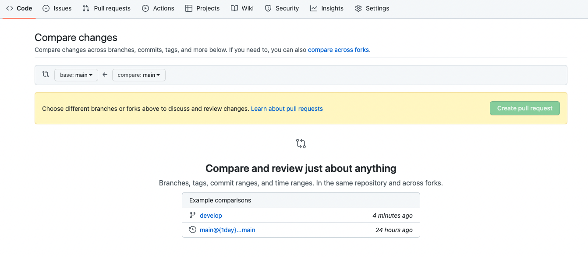
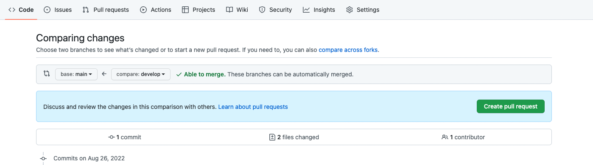
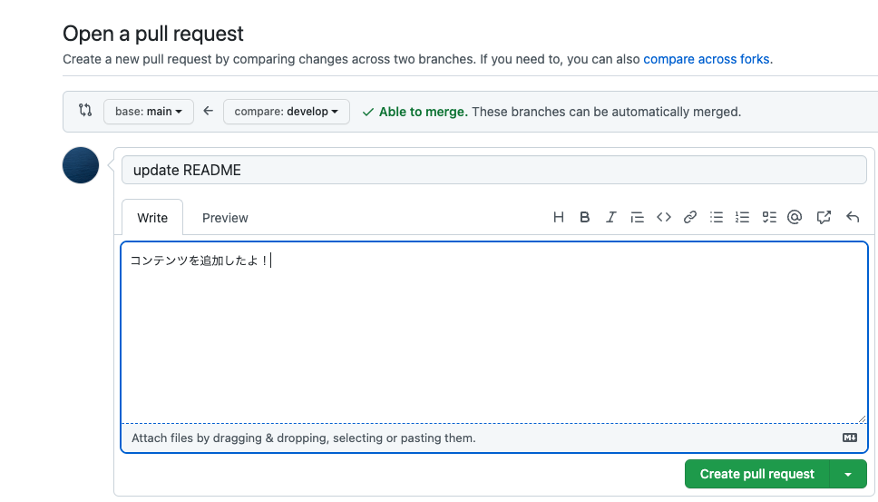
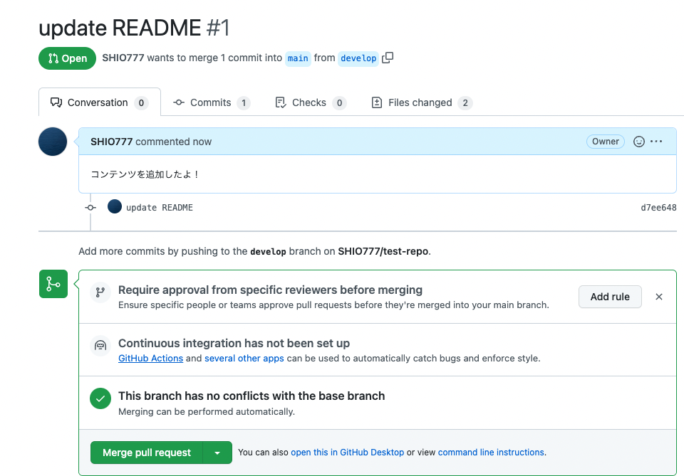
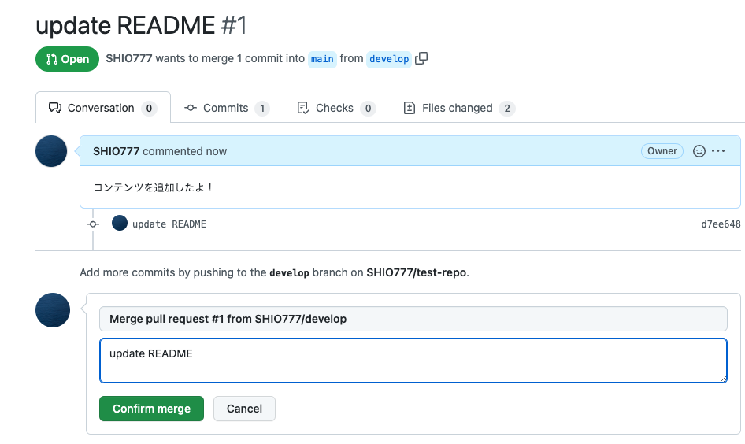
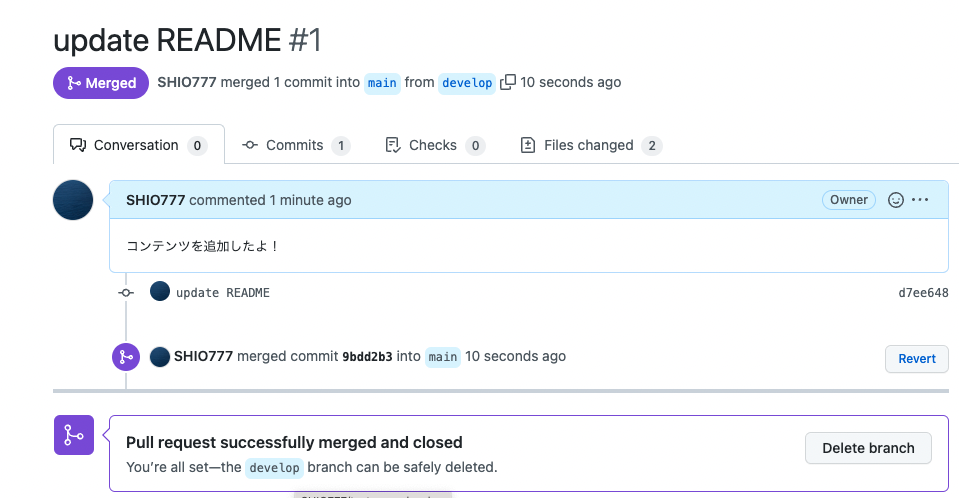

# test
Description

# chapter01
Hello, world!!!

# 基本的なコマンド
```.git
git clone YOUR_REPOSITORY_URL

git add .
git commit -m "COMMIT MESSAGE"
git push origin main
```

# Branchの作成
```.git
git branch develop  # developというbranchを作成する
git switch develop  # mainブランチからdevelop ブランチに変更
git branch          # Branchを全て表示する

## 編集後
git add .
git commit -m "YOUR_COMMIT_MESSAGE"
git push origin develop     # Caution! mainではなく，develop
```

# Merge
developブランチ作成後，mainブランチにマージする．
## 1
Githubを開き，Pull requestsページに行く．
`New pull request`ボタンを押し，下のページにいく．

## 2
左上の`main <- main`を`main <- develop`に変更する．

## 3
プルリクエストする．メッセージを追加し，`Create pull request`を押す．

## 4
`merge pull request`ボタンを押す．

## 5
`Confirm merge`ボタンを押す．

## 6
マージ成功！！


## Merge終了後

```.git
git switch main             # brahchをmainに切り替える
git pull origin main        # Github上の最新バージョンをローカルに反映する
 ```